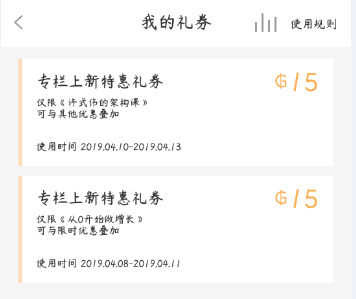
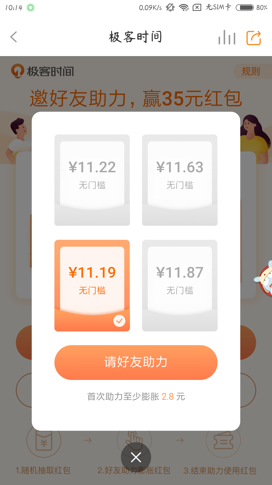
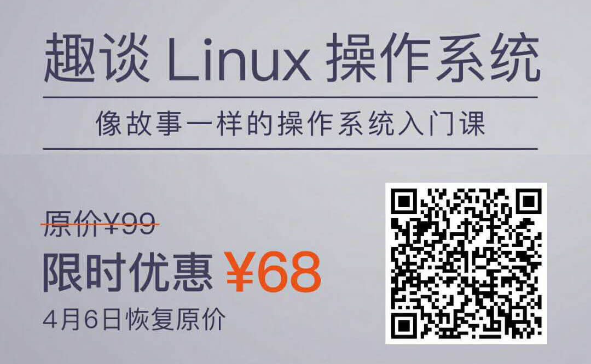
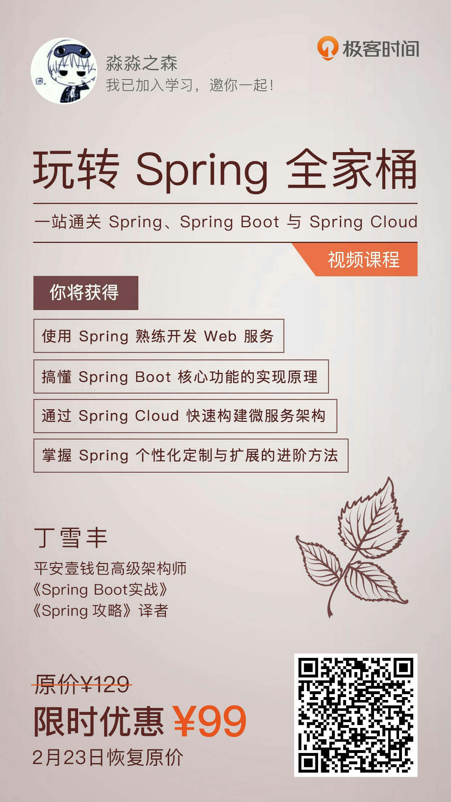

# 极客时间优惠
**优惠购课攻略一共三步，耐心看完，你将发现课程价格优惠到你不敢想象！！！**
 

## 第一步：如果你是新注册用户
- 先领30元的新人优惠券，再看第二步； 
优惠券领取地址：[戳这里](https://time.geekbang.org/activity/getinvite?gk_ucode=0BF856BA0EF8A6)
 
- 如果你是老用户了，是不是的还能收到极客时间派发的惊喜哦！ 

 
- 最近极客时间的派发红包活动不知道你想不想来凑个热闹呢？ 
最近极客时间还有“助力红包”领取，让购课更实惠；不知道怎么领取的，点击该链接[http://gk.link/a/102V0](http://gk.link/a/102V0)
 

  

 

## 第二步：再选择心仪的课程扫码购买

 

## 第三步：加我好友，领取返现
**因为极客时间会随时有活动，你们扫我二维码购买课程后，我获得的返现赏金不固定；但是请放心，我赚多少赏金，我给大家发多少红包，不为赚钱，仅仅是为大家提供一个方便；毕竟极客时间的课程是真心不错的！**

